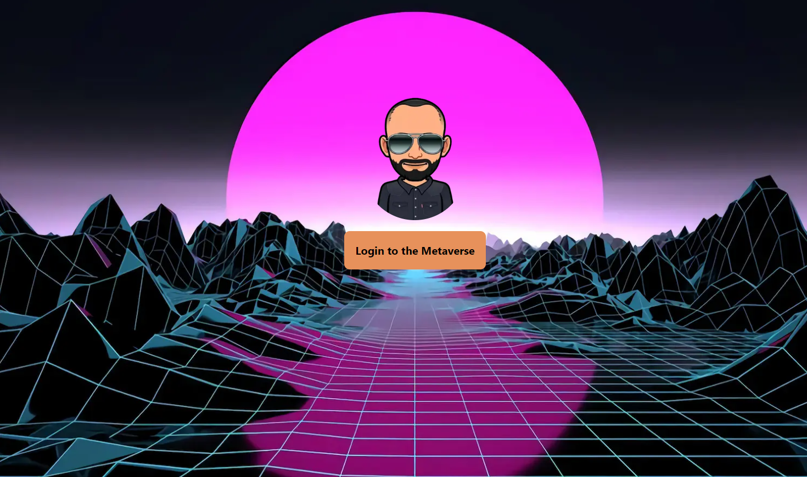

# **Chat Web3 Messenger dapp**

## Web3 Dapp built with :

<span style="margin-bottom: 10px"></span>

<!--
 : Badge Technologies
--->

 <span style="margin-left: 12px"></span>  <span style="margin-left: 12px"></span> 

## **Rendering**

#



#

## How to use

Execute [`create-next-app`](https://github.com/vercel/next.js/tree/canary/packages/create-next-app) with [npm](https://docs.npmjs.com/cli/init), [Yarn](https://yarnpkg.com/lang/en/docs/cli/create/), or [pnpm](https://pnpm.io) to bootstrap the example:

```bash
npx create-next-app --example with-tailwindcss with-tailwindcss-app
```

```bash
yarn create next-app --example with-tailwindcss with-tailwindcss-app
```

```bash
pnpm create next-app --example with-tailwindcss with-tailwindcss-app
```

**or**

> Clone the repository

---

[](https://vercel.com/new/git/external?repository-url=https://github.com/vercel/next.js/tree/canary/examples/with-tailwindcss&project-name=with-tailwindcss&repository-name=with-tailwindcss)

Deploy it to the cloud with [Vercel](https://vercel.com/new?utm_source=github&utm_medium=readme&utm_campaign=next-example) ([Documentation](https://nextjs.org/docs/deployment)).
